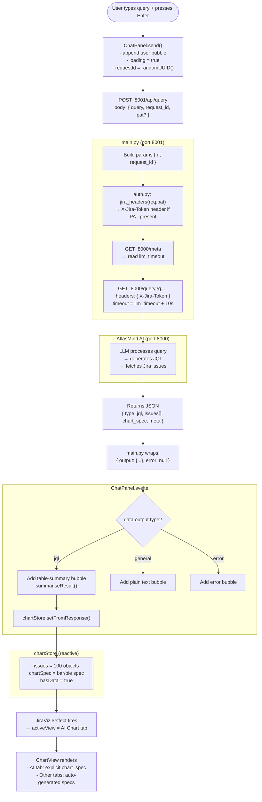
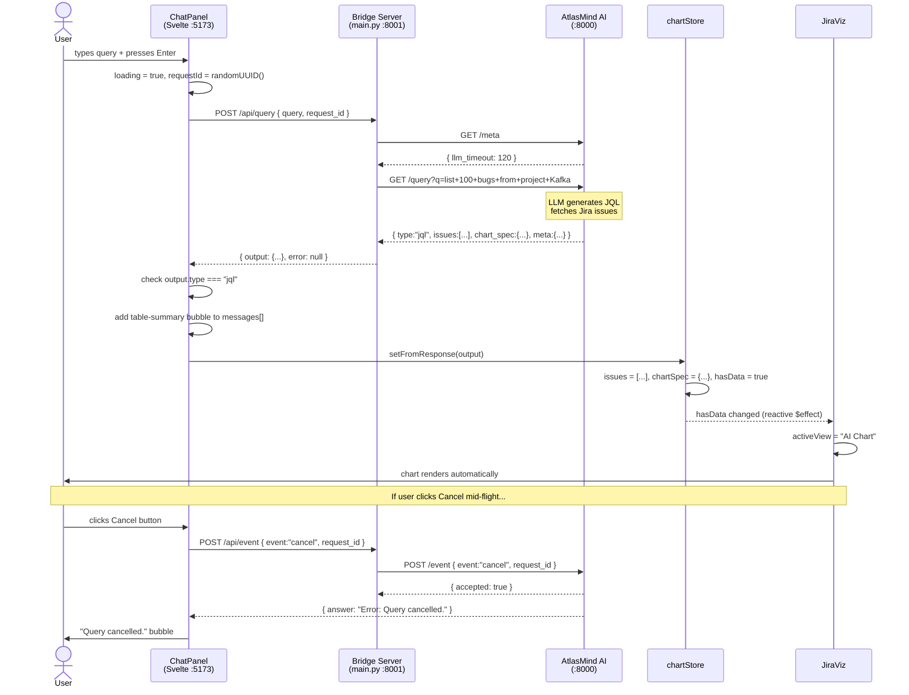
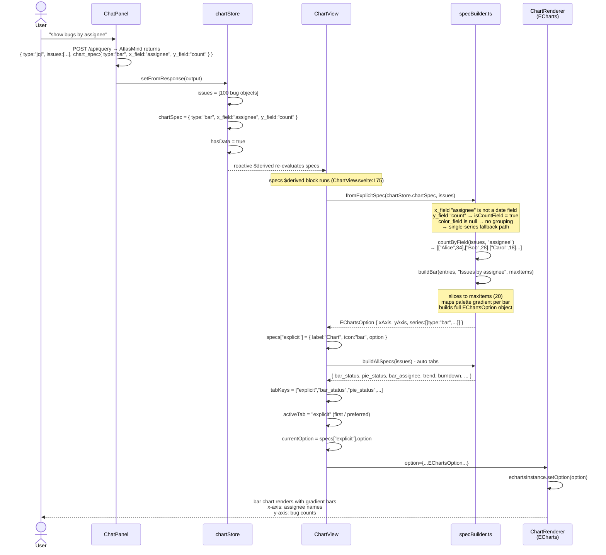
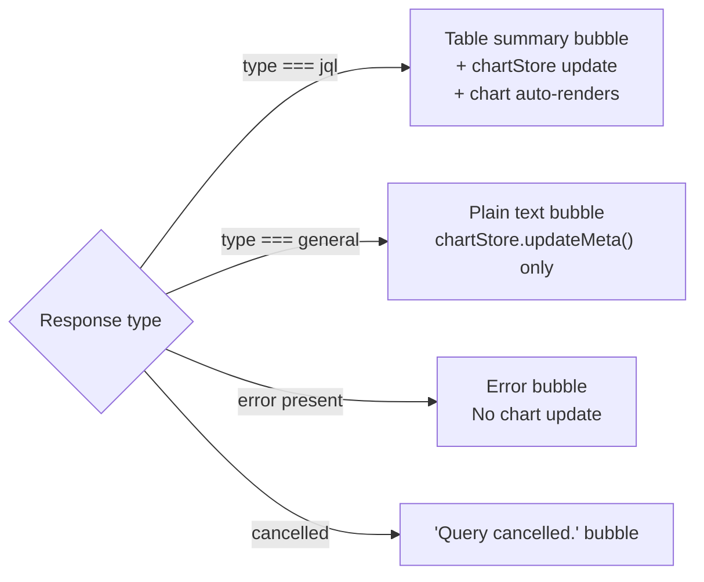
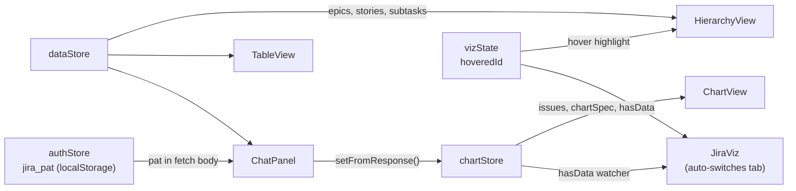
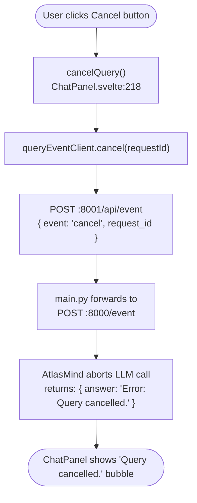

# AtlasMind Frontend - Architecture & Query Flow

## Port Map

| Service | Port | Started by |
|---|---|---|
| Svelte dev server (Vite) | 5173 | `npm run dev` (dev only) |
| Bridge / API server | 8001 | `uv run main.py` |
| AtlasMind AI backend | 8000 | separate process (not in this repo) |

**Production mode:** only port 8001 is active. FastAPI serves the pre-built `jira-viz/dist/` directly.  
**Dev mode:** both 5173 and 8001 run. Vite proxies `/api/*` to 8001.

---

## Key Files

| File | Role |
|---|---|
| `main.py` | FastAPI bridge server. Translates POST `/api/query` → GET `:8000/query` |
| `config/defaults.py` | Port/host constants used by `main.py` |
| `jira-viz/src/lib/JiraViz.svelte` | Root shell — 3-row layout, mounts all views, watches `chartStore.hasData` to auto-switch to chart tab |
| `jira-viz/src/lib/ChatPanel.svelte` | AI chat sidebar. Handles send/cancel, demo vs live mode, parses response type |
| `jira-viz/src/lib/charts/chartStore.svelte.ts` | Reactive bridge store — ChatPanel writes, ChartView reads |
| `jira-viz/src/lib/charts/specBuilder.ts` | Converts API issues → ECharts option objects |
| `jira-viz/src/lib/charts/ChartView.svelte` | Tab bar + ECharts renderer. Merges AI spec + auto-generated specs |
| `jira-viz/src/lib/dataStore.svelte.ts` | Holds Jira issues (CSV or sample data). Used by HierarchyView + TableView |
| `jira-viz/src/lib/state.svelte.ts` | Cross-component hover state (`vizState.hoveredId`) |
| `auth.py` | Auth helper. Reads `JIRA_PAT` env var; `jira_headers(req.pat)` returns the `X-Jira-Token` header dict forwarded to AtlasMind |
| `jira-viz/src/lib/auth.svelte.ts` | Svelte 5 PAT store singleton. Persists token in `localStorage`. Exposes `isAuthenticated`, `save()`, `clear()` |
| `jira-viz/src/lib/PatPrompt.svelte` | Self-contained PAT input component. Shown in ChatPanel when `liveMode && !authStore.isAuthenticated` |

---

## Query Flow (Live Mode)

### Example: "list 100 bugs from project Kafka"



---

## Sequence Diagram



---

## Bar Chart Creation - Sequence Diagram



---

## Response Branching



---

## Reactive State Stores

All stores are Svelte 5 rune-based classes exported as singletons.



### `chartStore` fields

| Field | Type | Purpose |
|---|---|---|
| `issues` | `ApiIssue[]` | Issues from latest query (preserved on zero-result responses) |
| `chartSpec` | `ChartSpec \| null` | Explicit chart spec from server (`chart_spec` snake_case) |
| `data` | `QueryResponse \| null` | Full raw server response |
| `query` | `string` | Query text that produced the result |
| `noResults` | `boolean` | True when last query returned 0 issues |
| `lastMeta` | `ServerMeta \| null` | Model name + LLM timeout from latest response |
| `backendAlive` | `boolean` | Updated by `/api/meta` polling |
| `hasData` | `boolean` (getter) | `issues.length > 0` — watched by JiraViz to auto-switch tabs |
| `authStore.pat` | `string` (`auth.svelte.ts`) | PAT store — `isAuthenticated`, `save()`, `clear()` |

---

## Demo vs Live Mode

Toggled by the **Demo / Live** button in ChatPanel header.

| | Demo | Live |
|---|---|---|
| How detected | path does NOT start with `/live` | path starts with `/live` |
| Query handling | Local keyword matcher `respond()` against `dataStore` | POST to `/api/query` → AtlasMind |
| Backend needed | No | Yes (port 8000) |
| Chart updates | No | Yes (on `type === "jql"` response) |

---

## Authentication

### Strategy

PAT (Personal Access Token) with `Authorization: Bearer <token>`.
Confirmed via Rovo that the Jira Server instance uses `WWW-Authenticate: Bearer`.

### Flow

```
User enters PAT in PatPrompt → saved to localStorage → sent as pat in POST body
  → main.py: auth.py jira_headers(req.pat) → X-Jira-Token header
  → AtlasMind (port 8000): reads X-Jira-Token → Authorization: Bearer <PAT> → Jira REST API
```

### Priority

| Source | When used |
|---|---|
| `req.pat` (from UI, per-request) | Cloud deployment — user enters PAT in PatPrompt |
| `JIRA_PAT` env var (fallback) | Docker/local deployment — set at container start |
| Neither | No auth header sent — works for public Jira (e.g. Apache) |

### New Files

| File | Purpose |
|---|---|
| `auth.py` | Single function `jira_headers(pat)` — all header logic lives here |
| `jira-viz/src/lib/auth.svelte.ts` | PAT rune store — `save()`, `clear()`, `isAuthenticated` |
| `jira-viz/src/lib/PatPrompt.svelte` | PAT input UI — shown once in Live mode; drop in or remove independently |

### To Remove Auth Entirely

1. Delete `auth.py`, `auth.svelte.ts`, `PatPrompt.svelte`
2. In `main.py`: remove `from auth import ...`; replace `_jira_headers(req.pat)` with `{}`
3. In `ChatPanel.svelte`: remove `import { authStore }` and `import PatPrompt`
4. In `ChatPanel.svelte`: remove `pat: authStore.pat` from the fetch body

### Deployment Notes

- **Cloud (AWS):** HTTPS via ALB + ACM is required — PAT travels in the HTTPS-encrypted request body. User enters PAT once in `PatPrompt`; stored in `localStorage`.
- **Local / Docker:** Set `JIRA_PAT` env var — `docker run -e JIRA_PAT=xxx ghcr.io/yourorg/atlasmind:latest`. `PatPrompt` is skipped because `auth.py` uses the env var fallback.
- **Public Jira:** Omit `JIRA_PAT` entirely — no auth header is sent; read-only public APIs work unauthenticated.

---

## Cancel Flow


